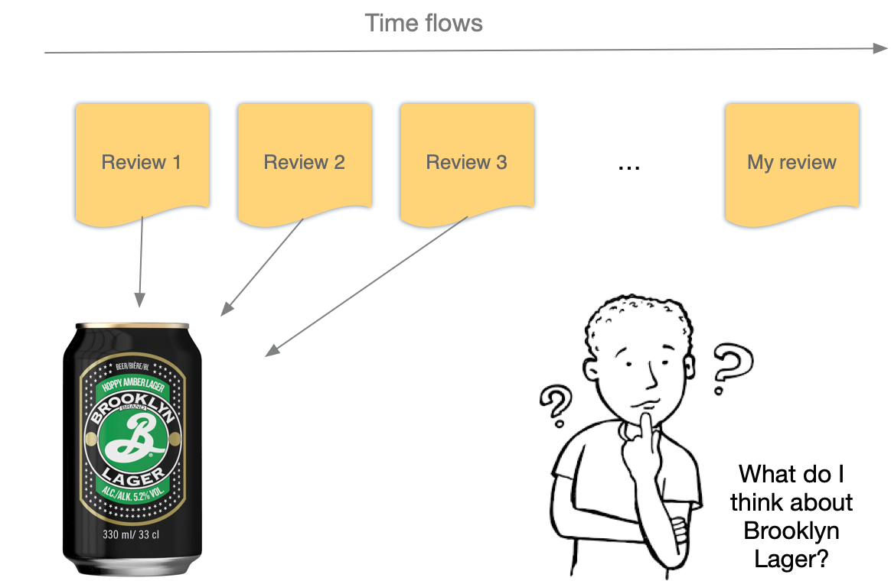

# Social influence and product reviews

## Context: experiential goods

An album. A glass of wine. A piece of contemporary art. These are a few examples of experiential goods — goods whose quality is neither completely objective nor completely subjective. For example, it seems hard to get a collective agreement on the best wine in the world. However, wine connoisseurs can consistently discriminate between top-tier wines Vs second- or third-tier ones.

Since the quality of experiential goods isn’t set in stone, a consumer’s attitudes are substantially influenced by the attitudes of reference others. The process through which consumers (and, more generally, individuals) influence each other is called social influence. See for example the work of *New York Times* bestselling author Robert Cialdini.

[Influence](https://www.goodreads.com/book/show/55338951-influence-new-and-expanded)

The key intuition behind the research on social influence is that the attitudes an individual *i* develops toward an offering *k* depends on:

- the initial attitude of *i* toward *k* (let’s say what *i* would think about *k* is he/she lived on a desert island)
- the attitudes of reference others *J* = {j1, j2, … , jN} towards *k*

## Problem: social influence and product reviews

Any time we write a product review (unless we’re the very first person to cover a product), we’re influenced by what others have written before us. For example, our review may focus on product features that have been already covered in the previous reviews (e.g., the balanced sweetness of Brooklyn Lager). Then, the reviews concerning a product may become more and more homogenous — potentially less helpful — over time.

You’re supposed to use the [beer reviews corpus](https://github.com/simoneSantoni/NLP-orgs-markets/tree/master/sampleData/beerReviews) to assess whether and to what extent the reviews concerning individual beers become more semantically homogenous over time. Addressing that problem could offer valuable insights into the social media strategies of breweries (e.g., adjusting a marketing campaign for a new beer on the basis of what consumers [don’t] say) as well as for a community manager interested in stimulating ‘fresh’ reviews on the part of contributors.