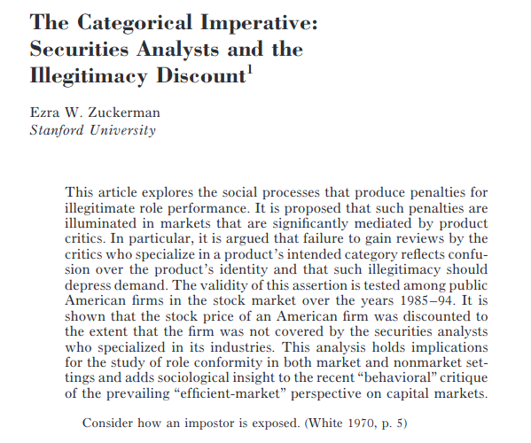
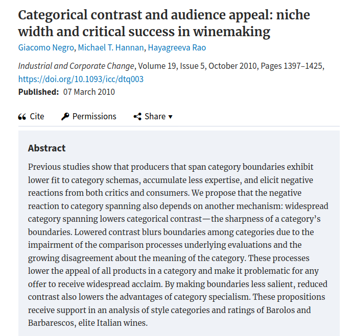
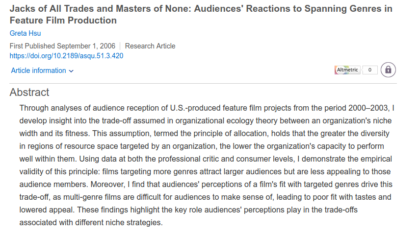
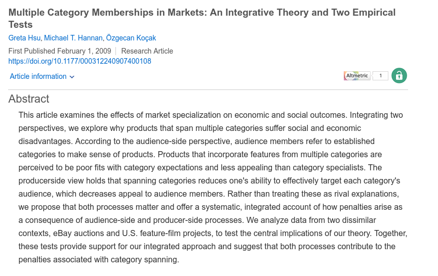

Extra-session on sentiment analysis
===================================

Business problem
================

+ product-market categories are essential infrastructures of markets
  - a 'category' is a socially-shared label
    * when people use the label 'Italian cuisine' they agree, to a certain
      extent about what constitutes an Italian dish
  + a 'category' is a recognizable type of product, i.e., a distinctive set 
    of features

Why do product-market categories matter?
========================================

+ producers appreciate competitive ties based on cognitive categories
    (e.g., Porac, Thomas, & Baden-Fuller, 1989)
+ consumers infer the unknown quality of an offering based on the fit
    with a category
+ categories facilitate the interaction between producers and consumers (they
    act as interfaces) 

Category-spanning penalty
==========================

+ an offering that is associated with multiple categories tends to be devalued
+ there are two mechanisms in place:
  - lack of expertise: consumers don't buy producers master multiple skills or 
    credibly combine diverse knowledge bases
  + confusion in evaluation: assuming expertises are not problem, consumers lack
    clear reference points to evaluate 'weird' offerings
    

Evidence ― financial analysts' coverage
========================================

Evidence ― wine market
======================

Evidence ― movie market
=======================

Evidence ― Ebay 
=======================

Sentiment analysis application
==============================

Assuming you have access to product review data, how wold you capture the
lack of expertise and confusion in evaluation as two affect states?

Specify the various steps of the work-flow.
