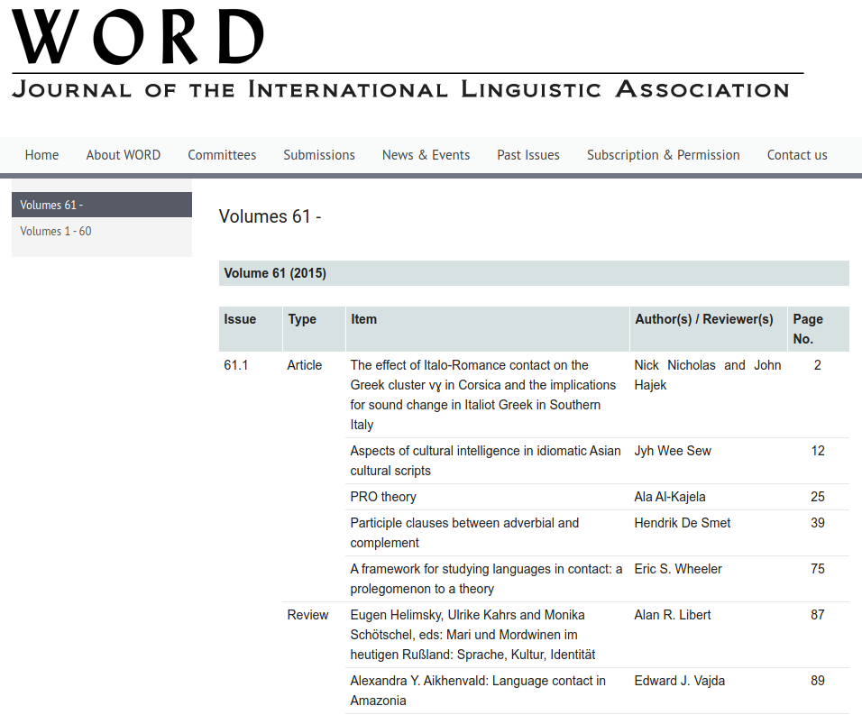
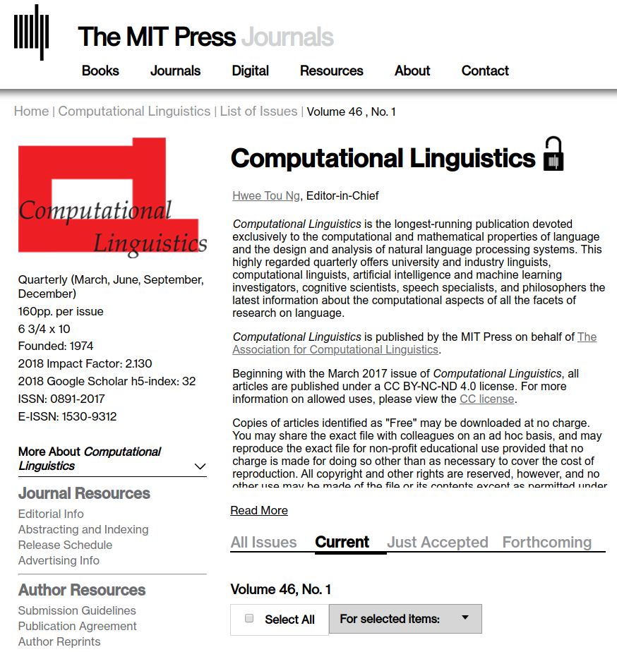
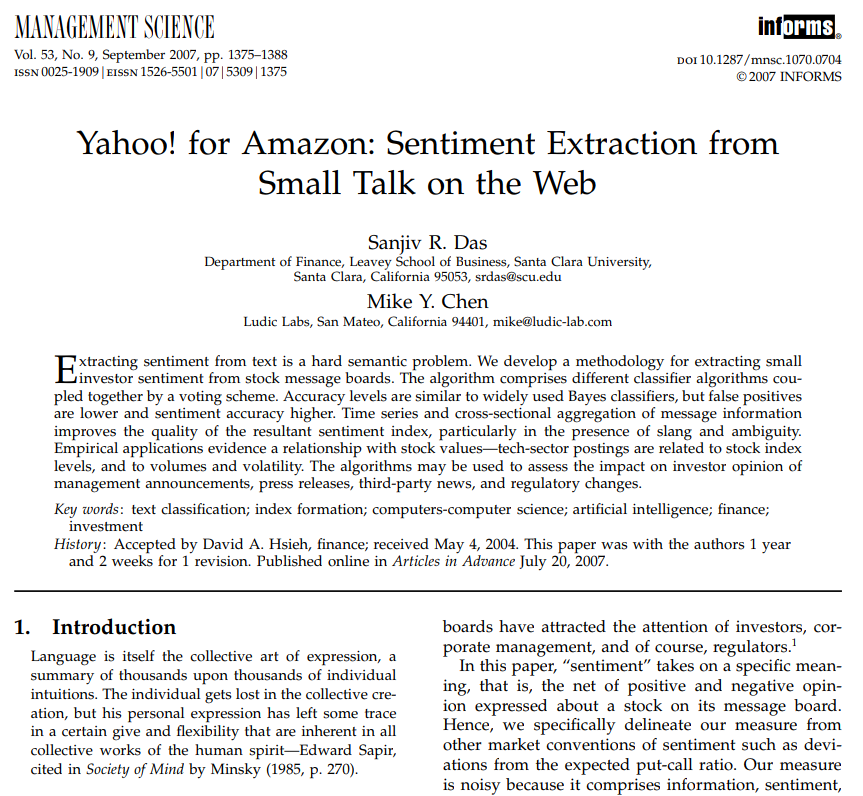
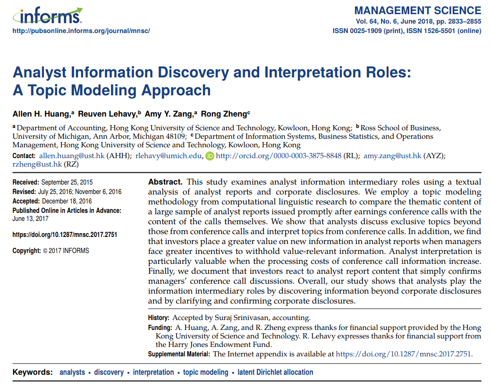
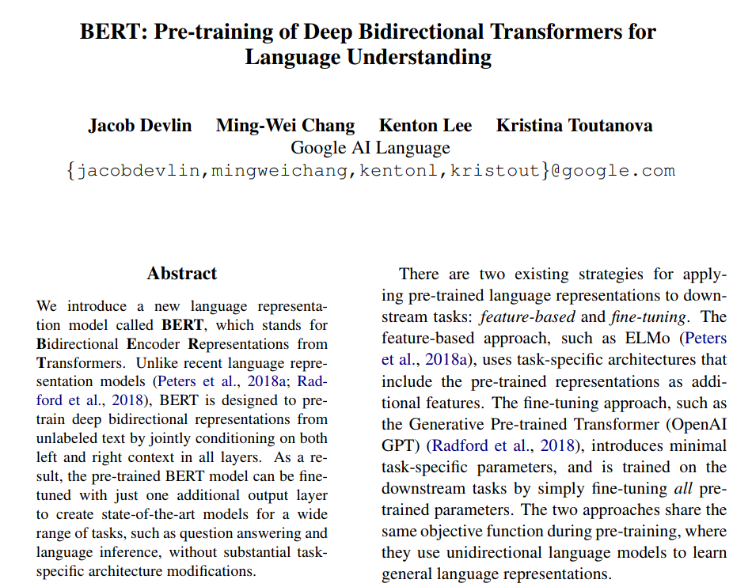
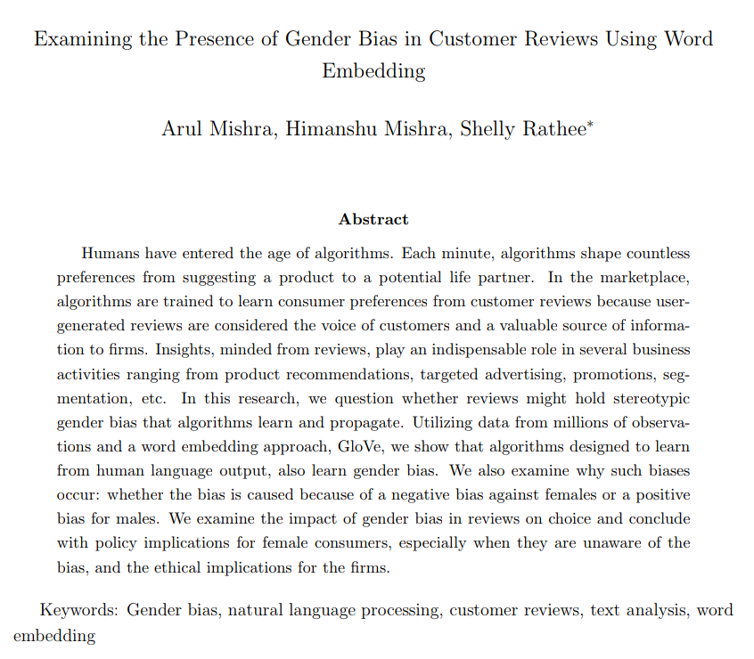
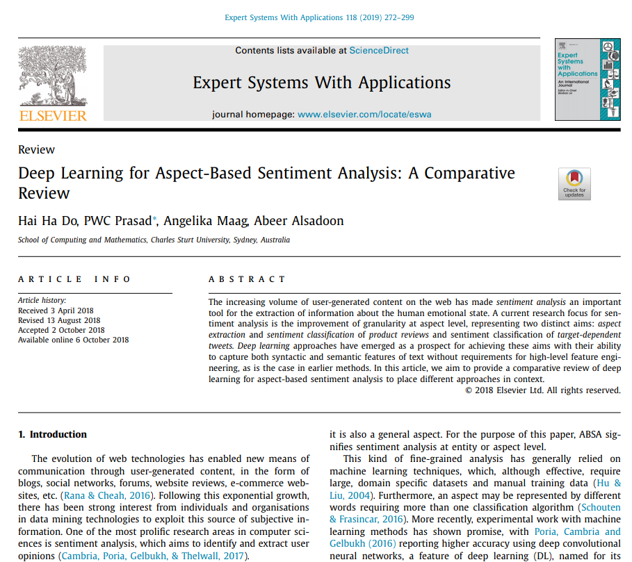

### Week 1, Intro to NLP

---

# Overview of NLP: Agenda

+ conceptual and methodological roots
+ scope of application
+ established tools
+ hot topics

---

# Conceptual and methodological roots

+ (computational) linguistics: it offers the theory and analytical frameworks to understand and represent natural language

+ computer science: it offers the infrastructure to encode and manipulate natural language data

+ ML/DL: it offers the tools to discover the linguistic properties (e.g., semantics) of text corpora at a scale

---

## A prominent journal in linguistics

---

## A prominent journal in (computational) linguistics

---

# NLP & ML/DL revolution

---

# Scope of application

+ NLP is a vast and fragmented field of research and practice that could confuse newbies

+ Let's try to make order/sense by grouping NLP applications into two categories:

    - operational applications
    
    - strategic application

---

# Operational applications

For example:

+ text summarization
+ classification
+ speech recognition and synthesis
+ dialogue systems and chatbots
+ question answering
+ text translation
+ phonetics

---

# Strategic applications

For example:

+ language modeling
+ vector semantics and embeddings 
+ topic modeling
+ sentiment analysis
+ information extraction

---

# Gamut of NLP tools & SMM694

+ operational applications are close to the world of software engineering

+ SMM694 focuses on the class of strategic applications of NLP, which are closer to the community of computational linguists and data scientists

| Week | Topic                          |
|:----:|:-------------------------------|
| 2    | Language modeling              |
| 3    | Vector semantics and embeddings|
| 4    | Topic modeling                 |
| 5    | Sentiment analysis             |
| 6    | Information extraction         |

---

# Established topics ― must-have skills

+ 'simple' sentiment analysis
+ topic modeling

---

# Example of 'simple' sentiment analysis

[>> go to the full paper](https://srdas.github.io/Papers/chat_FINAL.pdf)

---

# Example of topic modeling

[>> go to the full paper](https://www.amyzang.org/uploads/2/6/5/5/26555370/publication_huang_lehavy_zang_and_zheng_2018_ms.pdf)

---

Hot topics

+ context-aware models of the language 
+ statistical analysis of word vectors and embeddings
+ 'nuanced' sentiment analysis & DL
+ information extraction & DL

---

# BERT ― an example of context aware model of the language

[>> go to the full paper](https://arxiv.org/pdf/1810.04805.pdf?)

---

# Example of statistical analysis of word vectors/embeddings

[>> go to the full paper](https://arxiv.org/pdf/1902.00496.pdf)

---

# Example of 'nuanced' sentiment analysis

[>> go to the full paper](http://tinyurl.com/y722xzjg)

---

# Example of information extraction

[>> go to the full paper](https://www.sciencedirect.com/science/article/pii/S187705091932071X)

---

# Contents of 05.20 webinar

+ Q&A session
+ regular expressions
+ words and text corpora
+ text normalization
+ minimum edit distance
